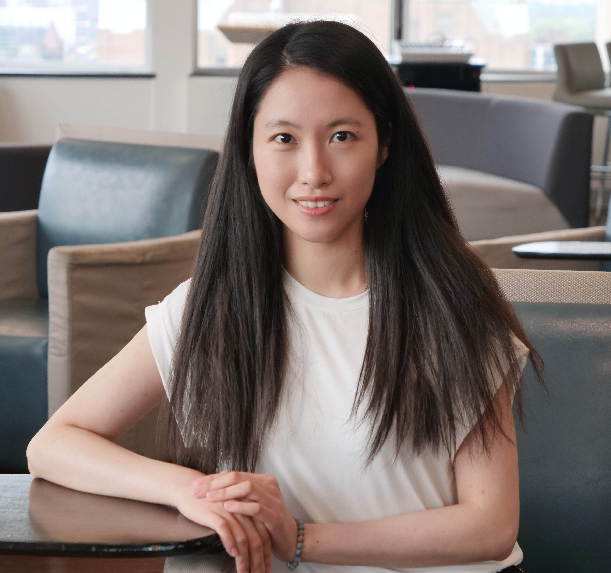

  
  

    <h1 style="margin: 0;">ZHANHONG SU</h1>
    
注册临床心理咨询师

    

      <a href="mailto:zhanhongsucounselling@outlook.com">zhanhongsucounselling@outlook.com</a> | 
      <a href="https://www.linkedin.com/in/viola-su-b67143166/">领英</a> 
    

  

## 专业简介
在过去八年中，我有幸在社区环境中陪伴许多孩子、青少年和家庭走过他们的成长旅程。作为一名注册临床心理咨询师（RCC），我最重视的是为每位来访者营造一个安心、温暖的空间，让您在这里能真切地感受到被理解与被接纳。

我在中国成长，后来在加拿大求学和工作，这些经历让我特别能体会在文化适应、身份认同过程中可能遇到的困惑与挑战。这段跨文化的生活也教会我，每个人的生命故事都如此独特而珍贵。这些年我尤其专注于支持自闭症和神经多样性群体，帮助他们在接纳自己独特思维和感受方式的同时，找到属于自己的幸福生活之道。

我始终相信，您才是自己生命故事的主人。心理咨询对我来说，是一段我们并肩同行的旅程。我会带着真诚的好奇心与同理心，陪您一起探索那些影响您的情绪、想法和生活经历。无论您正在面对焦虑、情绪困扰、人生转折或育儿挑战，我都会以最贴近您需求的方式，与您共同寻找内在资源与成长的可能。

## 服务领域
- 成人心理咨询
- 焦虑情绪
- 注意力缺陷/多动症（ADHD）
- 自闭症谱系
- 儿童心理咨询（0-13岁）
- 抑郁情绪
- 目标设定
- 人生转折适应
- 多元文化议题
- 亲子教育
- 人本主义疗法
- 个人成长
- 自尊提升
- 压力管理
- 儿童/青少年自杀意念干预
- 青少年心理咨询（14-19岁）
- 创伤疗愈

## 治疗方法
- 接纳与承诺疗法（ACT）
- 愤怒情绪管理
- 应用行为分析（ABA）
- 艺术治疗
- 认知行为疗法（CBT）
- 辩证行为疗法（DBT）
- 情绪聚焦疗法（EFT）
- 整合疗法
- 正念认知行为疗法
- 动机式访谈
- 叙事疗法
- 线上心理咨询
- 人本主义疗法
- 游戏治疗
- 沙盘治疗
- 优势取向治疗
- 电话心理咨询

## 专业经历

### 儿童与青少年心理健康治疗师
*BC省公共服务部门* | 2024年3月至今 
<li>开展客户访谈，根据严重程度和紧急性筛选并分级个案，完成全面初始评估，协调社区机构为客户对接适宜支持服务</li>
<li>熟练运用多种评估工具，包括《简式儿童家庭电话访谈（BCFPI）》《患者健康问卷（PHQ）》《广泛性焦虑量表（GAD）》《贝克抑郁量表（BDI）》及《儿童焦虑性情绪障碍筛查表（SCARED）》</li>
<li>运用认知行为疗法（CBT）、辩证行为疗法（DBT）、游戏治疗及沙盘治疗等循证方法开展个体/团体治疗</li>
<li>执行紧急自杀风险评估，为危机客户制定个性化安全计划，通过即时干预保障其安全与福祉</li>
<li>与多学科团队（心理治疗师、心理学家、精神科医生等）协作制定整体治疗计划</li>

### 研究助理 
*多伦多大学实习项目* | 2022年9月至今
<li>协助定量研究（元分析、Excel数据清洗）与定性研究（NVivo编码、转录）</li>
<li>完成文献综述、参考文献核验及数据准备工作</li>
<li>设计研究问题并通过海报展示研究成果</li>

### 行为干预师
*自雇执业* | 2017年2月至今
<li>为自闭症儿童实施ABA行为干预计划，改善情绪调节、社交技能、解决问题能力、生活技能及学业表现</li>
<li>联合儿童、家庭、学校及社区提供跨场景一致性支持</li>
<li>收集分析数据、记录进展，协同行为顾问团队调整干预方案</li>
<li>与家庭及专业人员保持透明沟通，确保干预计划个性化有效实施</li>

### 寄养家庭咨询师
*大温哥华家庭服务中心* | 2020年1月-2022年8月
<li>为寄养家庭、照料者及受照料儿童提供支持服务，保障安置安全稳定</li>
<li>提供心理咨询、创伤支持、危机干预、行为咨询及亲职教育</li>
<li>协助照料者制定安全计划并获取资源（经济援助、法律/医疗服务、职业培训）</li>
<li>协助寄养家庭申请社区、省级及受害者支持等各类资源服务</li>
<li>开展社区支持活动，增强寄养家庭的社区连结与资源网络</li>

## 教育背景

### 教育学硕士 - 发展心理学与教育方向
*多伦多大学* 

### 心理学学士 
*英属哥伦比亚大学* 

